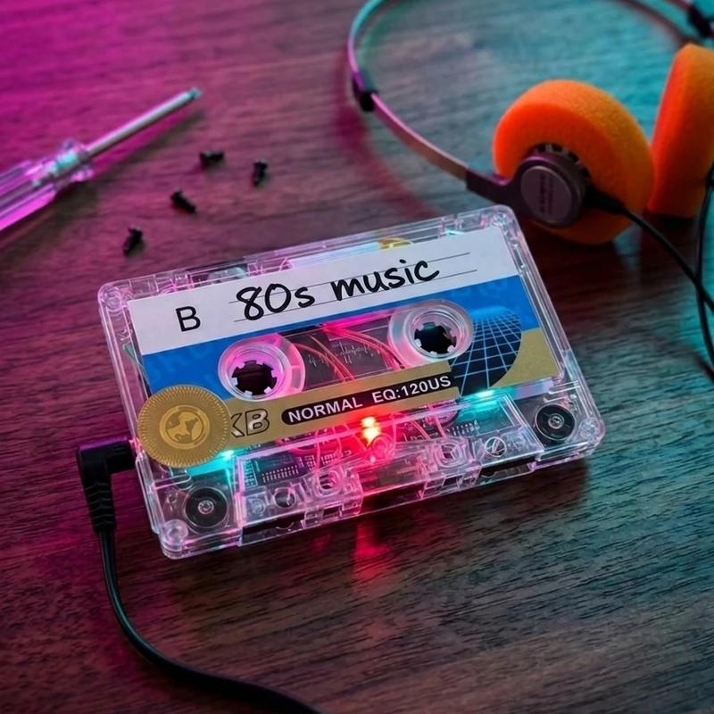
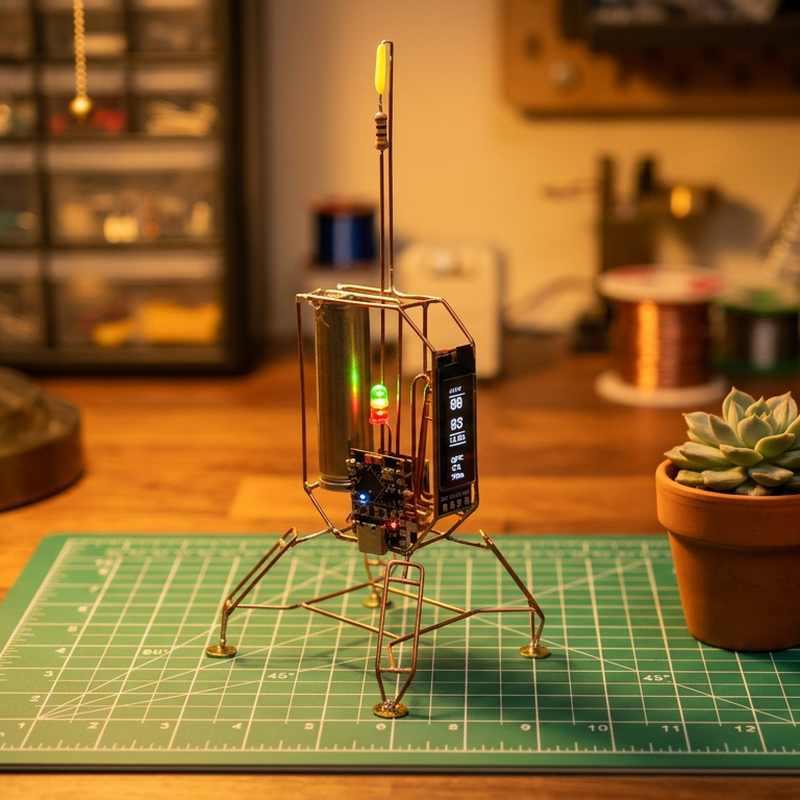
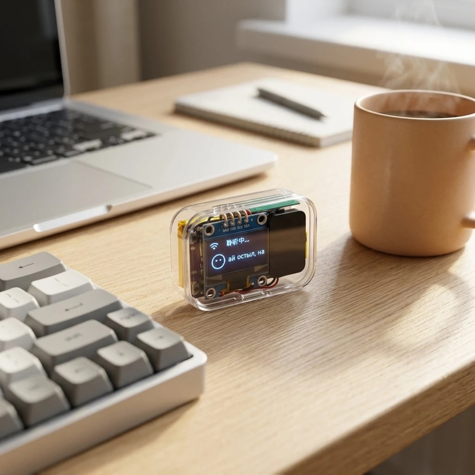

## About

Senior pre-sale analyst by day, **hardware hacker & AI automation builder** by night. I design and ship tools that bridge the gap between electronics, LLM capabilities, and real-world workflows. My stack: **Python / FastAPI / C++ / ESP32 / Docker / n8n / LLM APIs**.

---

## Hardware & Electronics

<table>
<tr>
<td width="50%">

</td>
<td width="50%" valign="top">

### [Pocket AI Voice Assistant 3.0](https://github.com/Vitalymt/Pocket-AI-Voice-Assistant-3.0)

**Pocket-sized AI assistant. Speak — it responds.**

ESP32-S3, 1.3" OLED display, magnetic charging, zero physical buttons. 43x43mm body. Smart sleep, OTA updates, web search via Tavily.

`C++` `ESP32-S3` `ESP-IDF` `I2S` `SH1106 OLED` `Tavily API`

</td>
</tr>

<tr>
<td width="50%" valign="top">

### [Neon Cassette](https://github.com/Vitalymt/Neon-Cassette---MP3-Player-in-a-Cassette-Shell)

**MP3 Player in a Cassette Shell**

A portable MP3 player hidden inside a real 1980s audio cassette. DFPlayer Mini + Li-Po battery. No microcontroller, no code — pure analog meets digital. Total cost: ~820 RUB (~$9).

`DFPlayer Mini` `TP4056` `Li-Po` `BC547`

</td>
<td width="50%">

</td>
</tr>

<tr>
<td width="50%">

</td>
<td width="50%" valign="top">

### [Pocket AI Voice Assistant 2.0](https://github.com/Vitalymt/Pocket-AI-Voice-Assistant-2.0)

**Next-gen palm-sized AI assistant**

Transparent acrylic case, hidden capacitive touch button, battery indicator, noise-filtering capacitor. Custom Xiaozhi firmware — rewritten from 16MB to 8MB RAM (using only 2MB), toggle activation, Tavily web search. ~2hr battery.

`ESP32-S3` `MAX98357A` `INMP441` `TTP223` `Tavily`

</td>
</tr>

<tr>
<td width="50%" valign="top">

### [Stellar Clock](https://github.com/Vitalymt/Stellar-Clock-ESP32C3-Supermini)

**Autonomous IoT desk clock on ESP32-C3**

Vertical OLED display showing time, date, temperature, humidity, and pressure. NTP sync over Wi-Fi. Li-Ion battery with USB-C charging. All firmware in C++.

`C++` `ESP32-C3` `PlatformIO` `I2C` `BME280`

</td>
<td width="50%">

</td>
</tr>

<tr>
<td width="50%">

</td>
<td width="50%" valign="top">

### [Pocket AI Voice Assistant v1.0](https://github.com/Vitalymt/Pocket-AI-Voice-Assistant)

**Palm-sized AI that listens, thinks, and speaks**

ESP32-S3 + Xiaozhi firmware. 45x30x16mm. Wi-Fi connected, OLED status display, cloud AI speech processing. All off-the-shelf modules, hand-soldered, transparent case showing every component.

`ESP32-S3` `Xiaozhi` `OLED SSD1306` `USB-C`

</td>
</tr>
</table>

---

## Software & AI

### [AnnonymizerForChrome](https://github.com/Vitalymt/AnnonymizerForChrome)
> Chrome extension (MV3) for **offline PII anonymization** in Russian text.

Processes everything locally in the browser — names, phones, INNs, passports, addresses, bank accounts. One-click restore via dictionary export/import. Supports PDF files.

`JavaScript` `Chrome Extension MV3` `PDF.js` `Regex` —   

---

### [HH-Job-Ranker](https://github.com/Vitalymt/HH-Job-Ranker)
> **Autonomous AI agent** for searching and evaluating vacancies on HH.ru.

Generates search queries, parses HH API, evaluates matches via LLM, displays ranked results in a web dashboard, and generates personalized cover letters.

`Python` `FastAPI` `APScheduler` `SQLite` `Docker` —   

---

### [Video Annotation Tool](https://github.com/Vitalymt/video-annotation-tool)
> Browser-based **frame-accurate video segment annotation** tool.

Open `index.html` — no server, no build step, no dependencies. Mark segments with `[` and `]`, assign labels, export structured JSON.

`HTML` `JavaScript` `Video API` —  

---

### [ProjectChat](https://github.com/Vitalymt/AI-project-chat-anonimaizer)
> **AI-powered project assistant** with document management and Obsidian integration.

Upload project docs, chat with AI in context, auto-anonymize PII, save analysis artifacts directly to Obsidian vault via WebDAV sync.

`Python` `FastAPI` `Vanilla JS` `SQLite` `Docker` `Obsidian` —  

---

## GitHub Stats

---

## Contact

